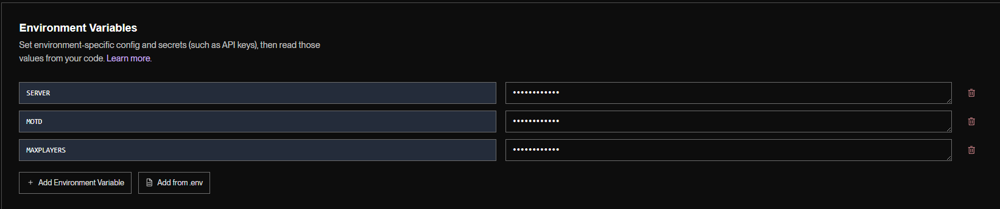

<h1> For Render: </h1>

 Step 1: Click Web Service.

 Step 2: Click Public Git Repository and connect this repository.

 Step 2.5: Set the name to be your server ip (eg. name: myserverip, ip: myserverip.onrender.com).

 Step 3: Set the branch to "render".

 Step 4: Click for a free Instance Type.

 Step 5: Create 3 Environment Variables (check images for names).

<h1> For Koyeb: </h1>#

